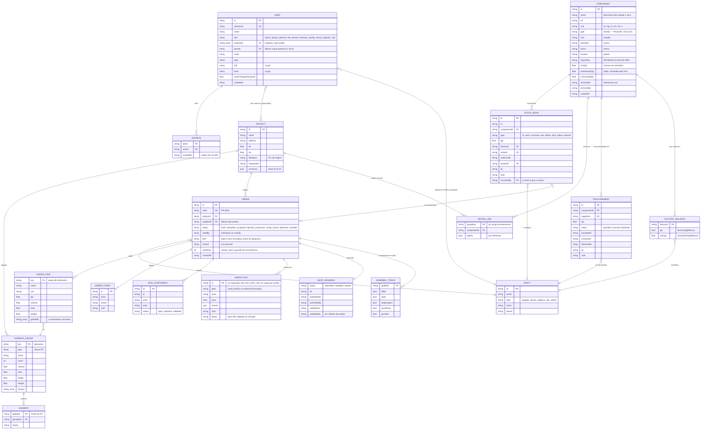

# TwinFlow — modelo de dados

Diagrama entidade-relação da plataforma, tirado do código e dos dados reais (v1.16.0).

**Uma nota antes de o ler.** Isto não é uma base de dados relacional clássica. O SQLite
guarda sete tabelas em que quase tudo vive numa coluna `data` em JSON, e as entidades a
cinzento no diagrama **não têm tabela própria**: são listas dentro do JSON do pedido, ou
objetos indexados por chave. Foram desenhadas na mesma porque são entidades do domínio — o
diagrama descreve o negócio, e a seguir explica-se onde é que cada uma mora de facto.

## Onde é que cada coisa mora

O SQLite (`data/twinflow.db`) tem **sete tabelas**, e só as cinco primeiras correspondem a
entidades do diagrama:

| Tabela | Entidade | O que está em `data` (JSON) |
| --- | --- | --- |
| `projects` | PROJECT | `groups` (ELEMENT_GROUP → ELEMENT), `recipes` (RECIPE_LINE), `summary` |
| `orders` | ORDER | `items`, `events`, `nonConformities`, `inspections` (lista), `tracking`, `shopDrawings` |
| `parties` | PARTY | contactos |
| `components` | COMPONENT | descritores, `factoryQty` e `factoryMinQty` (FACTORY_BALANCE) |
| `stock_moves` | STOCK_MOVE | o movimento inteiro |
| `procurement` | PROCUREMENT | a encomenda inteira |
| `meta` | — | `rev`, `seq` e os marcadores de migração |

**USER e SESSION vivem à parte**, fora do estado partilhado, porque só o servidor lhes toca
e nunca são enviados para o cliente com as palavras-passe.

## As regras que o diagrama não consegue mostrar

Um ER diz que uma coisa aponta para outra. Não diz **quando** é que apontar é legítimo, e
neste sistema é aí que está quase toda a lógica:

- **ORDER.status não é um campo livre, é uma máquina de estados.** `draft → submitted →
  accepted → production → ready → transit → delivered → installed`, e cada passo tem um
  perfil que o pode dar. Três portões são obrigatórios: desenhos de fabrico validados antes
  de produzir, data e hora JIT antes de despachar, e uma só carga em trânsito de cada vez.
- **O saldo de um componente é uma consequência, não um valor.** `warehouseQty` e
  `factoryQty` só mudam por STOCK_MOVE. Uma importação de inventário cria movimentos de
  entrada a sério, precisamente para que nenhum número no armazém fique sem explicação.
- **RECIPE_LINE é o que liga o modelo ao stock.** Ao produzir, a receita do grupo diz quantos
  componentes cada elemento leva, e o servidor gera os movimentos `consume` sozinho.
- **ORDER_ITEM guarda `globalIds`** — os GUID do IFC. É esse fio que deixa seguir um painel
  do modelo até estar betumado em obra (ASSEMBLY_TRACK).
- **`orderRev` é o guarda de concorrência.** Quem escreve devolve a versão que leu; se não
  bater certo o servidor recusa (409). O administrador ultrapassa os portões de processo,
  mas **não** este — não é uma permissão, é o facto de outra pessoa ter escrito primeiro.
- **USER.partyId decide o que existe.** Uma conta ligada a uma fábrica recebe do servidor
  apenas o saldo dessa fábrica; o saldo de armazém chega como `null`. O que essa conta não
  pode ver não sai do processo.

## Fora da base de dados

- `models/<projectId>.ifc` — o ficheiro IFC de cada projeto, com versões anteriores
  arquivadas ao lado. Fora do webroot em produção.
- `<data>/training/*.jsonl` — o registo de decisões: cada ato com o contexto que existia no
  momento e o resultado que se veio a verificar. Sobrevive de propósito a uma reposição de
  dados.
- `<data>/backups/` — cópia diária da base de dados, as últimas 14.
